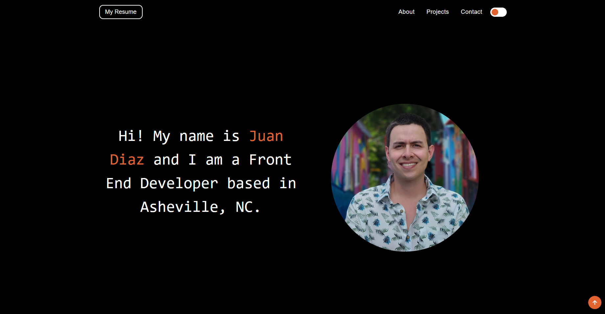
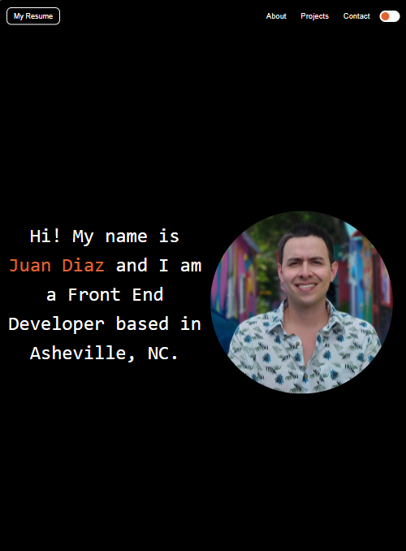
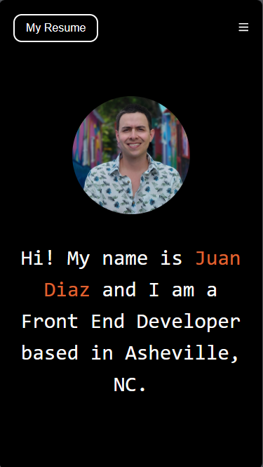
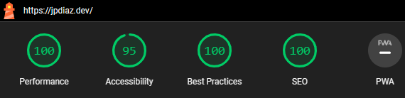

<div id="top"></div>

 <a href="https://jpdiaz.dev">
    
  </a>

# [JpDiaz](https://jpdiaz.dev)

Welcome to my personal website! I'm Juan Pablo Díaz, a Front-End Developer and UI/UX Designer. I'm passionate about creating beautiful and intuitive user interfaces, and I'm always looking for new opportunities to learn and grow.
<br>
<br>
<br>

<div align="center">
  <!--  -->
  <br>
  <a href="https://peerlist.io/1diazdev"></a>
  <a href="https://www.linkedin.com/in/1diazdev/"></a>
  <a href="mailto:juan.diaz.rodriguez93@gmail.com"></a>
  <a href="https://twitter.com/1diazdev"></a>
  <a href="https://dev.to/1diazdev"></a>
</div>

<div align="center">

[](https://jpdiaz.dev/)
[](https://stackblitz.com/github.com/JuanPabloDiaz/jpdiaz)

</div>

### Desktop View 🖥️



### iPad view 📱



### Mobile view 📱



### Lighthouse Score 🚀



Check out the [Lighthouse Report](https://performance-jpdiaz.netlify.app/) for more details.

### Built With 🔑


Features:

- ✅ Dark and light color mode
- ✅ Hero section with bio
- ✅ Portfolio collection
- ✅ Pagination support
- ✅ Post tags support
- ✅ Contact form
- ✅ View transitions
- ✅ Tailwind CSS
- ✅ Mobile-first responsive layout
- ✅ [Navbar with burger button](https://github.com/surjithctly/astro-navbar)
- ✅ [Image Optimization](https://unpic.pics/)
- ✅ SEO-friendly with canonical URLs and OpenGraph data
- ✅ Sitemap support
- ✅ Markdown & MDX support

## Useful Commands 🧰

- Run before Deploy: `$ npm run build`
- Run Prettier: `$ npm run format`
- Run Lighthouse in local: `$ npm run lighthouse`

## Get started 🛠️

To get started with [jpdiaz](https://jpdiaz.dev), simply clone the repository and follow the setup instructions. You'll be up and running in no time!

### Setup 📋

1. Clone the repo
2. Install dependencies
   ```sh
   npm install
   ```
3. Start the development server
   ```sh
   npm run dev
   ```
4. Open [http://localhost:5173/](http://localhost:5173/) with your browser to see the result.

## Contribution 🤝

I welcome contributions to the jpdiaz collection repo! Feel free to fork the repository and submit pull requests with your improvements. -->

## License 📜

[jpdiaz](https://jpdiaz.dev) is licensed under the MIT License.

I hope you enjoy using the jpdiaz repo!

<!-- ACKNOWLEDGMENTS -->

## Acknowledgments 📚

Resources list that I find helpful and would like to give credit to.

- [Astro](https://astro.build/)
- [AstroShip](https://astroship.web3templates.com/)
- I used [Astro Portfolio Template - Created by veranikabarel](https://github.com/veranikabarel/astro-portfolio) as a starting point for this project.
- [Tailwind CSS](https://tailwindcss.com/)
- [GitHub API](https://docs.github.com/en/rest)
- [Vercel](https://vercel.com/)

<p align="right">(<a href="#top">👆 Top 👆</a>)</p>
