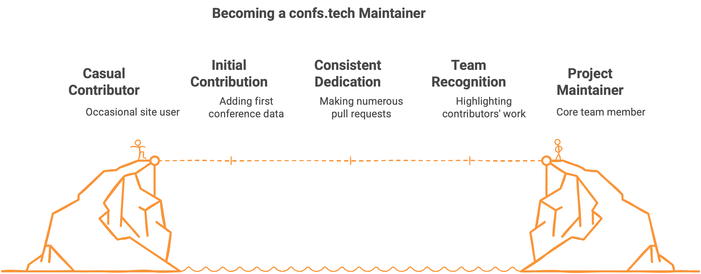

# Mi Experiencia como Mantenedor de confs.tech: Promoviendo el Código Abierto

El mundo del software de código abierto está lleno de oportunidades para quien quiere contribuir, aprender y crecer profesionalmente. Hoy quiero compartir mi experiencia como mantenedor de [confs.tech](https://confs.tech), un recurso que se ha convertido en una parte importante de mi vida profesional y que me ha permitido promover el código abierto de manera significativa.

## ¿Qué es confs.tech?

Para quienes no lo conocen, [confs.tech](https://confs.tech) es una lista completa y de código abierto de conferencias relacionadas con el desarrollo de software. El proyecto resuelve un problema común en la comunidad tecnológica: encontrar fácilmente conferencias relevantes para asistir, presentar o simplemente mantenerse informado sobre los eventos del sector.

Como indica su descripción:

> confs.tech: Lista de todas las conferencias tecnológicas del año. Encuentra tu próxima conferencia tecnológica. Una lista de código abierto y colaborativa de conferencias sobre desarrollo de software.

::github{repo="tech-conferences/confs.tech"}

::github{repo="tech-conferences/conference-data"}

## Mi camino hacia confs.tech

Mi relación con confs.tech comenzó de manera orgánica. Estaba buscando una conferencia tecnológica a la cual asistir cuando me encontré con este recurso. Al explorar el sitio, descubrí que cualquiera podía contribuir agregando más conferencias. Decidí hacerlo y la experiencia resultó increíblemente gratificante.

Lo que más me atrajo del proyecto fue el equipo detrás de él. Hay varios mantenedores y todos responden muy rápidamente, lo que hace que el proceso de contribución sea fluido y motivador.

## De contribuidor a mantenedor

Mi transición de contribuidor a mantenedor del proyecto fue el resultado de una dedicación constante. Realicé más de 400 PRs (Pull Requests) y contribuciones al proyecto. Me apasioné tanto por confs.tech que cuando vi la oportunidad, la tomé sin dudarlo. Pregunté si podía ayudar de manera más oficial y me dieron acceso como mantenedor, junto con una lista de responsabilidades.

## Mis contribuciones más significativas

Entre mis diversas contribuciones, hay una de la que estoy particularmente orgulloso: la creación de una página dedicada a mostrar al equipo detrás del proyecto. Esta página destaca primero a los mantenedores y luego a los contribuidores, con el objetivo de promover la participación y dar visibilidad a quienes hacen posible este recurso.

También implementé cambios similares en el README del proyecto, todo con el objetivo de reconocer el trabajo de quienes están detrás de confs.tech y fomentar un sentido de comunidad.

Además, he contribuido en varios aspectos de la UI, actualizando paquetes, solucionando bugs y realizando numerosas contribuciones para aumentar la lista de conferencias disponibles en la plataforma.

## Desafíos y aprendizajes

Como mantenedor, he enfrentado varios desafíos. Revisar PRs fue algo nuevo para mí, pero lo superé con práctica, estudiando PRs similares y observando cómo otros resolvían problemas similares para aprender buenas prácticas.

Otro gran reto fue entender la arquitectura del sitio y su funcionamiento. Lo abordé leyendo el código y revisando los PRs anteriores. Incluso hoy, sigo aprendiendo constantemente sobre el proyecto.

## El impacto en mi desarrollo profesional

Ser mantenedor de confs.tech ha enriquecido significativamente mi desarrollo profesional. He aprendido:

- A ser constante en mis contribuciones
- A solucionar bugs de manera efectiva
- A pedir ayuda cuando no sé cómo resolver algo
- A organizar mi tiempo para poder dedicarle atención al proyecto
- A proponer nuevas características útiles
- A corregir posibles errores
- A revisar PRs con criterio, evaluando cuidadosamente las conferencias propuestas
- A profundizar mis conocimientos de Git y GitHub

## La satisfacción del reconocimiento

Una de las mayores satisfacciones como mantenedor es recibir feedback positivo de los usuarios. Han sido muchas las ocasiones en que las personas reconocen nuestro trabajo y agradecen por este recurso que les ha sido muy útil para encontrar conferencias. Esta retroalimentación positiva es lo que me motiva a seguir contribuyendo al proyecto.

## Equilibrando el tiempo y las responsabilidades

Contribuir a un proyecto open source mientras se manejan otras responsabilidades personales y profesionales requiere equilibrio. Como me gusta decir: la vida es un balance, uno no puede pretender aprender programación en un día. Así como no aprendimos a caminar en un día, tampoco podemos pretender crear un proyecto open source y ser reconocidos por ello inmediatamente.

Todo es cuestión de constancia, dedicación y perseverancia. Se trata de organizarse, de encontrar tiempo durante el día, ya sea empezando con 20 minutos diarios o dedicando algunas horas los fines de semana. Poco a poco, todo va fluyendo.

Al final, uno le saca tiempo a lo que le importa. Es cuestión de evaluar también cuál es el beneficio de ello, que en mi caso ha sido enorme tanto personal como profesionalmente.

## Consejos para futuros contribuidores

Si estás interesado en contribuir al código abierto, mi consejo es simple: encuentra un proyecto que te guste, algo que uses día a día. Si es de código abierto, no dudes en contribuir. Pregunta en qué puedes ayudar, revisa los PRs e issues existentes, y empieza desde lo más simple.

No es necesario hacer grandes contribuciones desde el principio. Cada pequeño aporte cuenta y, con el tiempo, puedes convertirte en una parte esencial de la comunidad alrededor del proyecto.

## Conclusión

Mi experiencia como mantenedor de confs.tech ha sido increíblemente enriquecedora. Me ha permitido no solo mejorar mis habilidades técnicas, sino también ser parte de una comunidad global que valora y promueve el código abierto.

Si estás considerando contribuir a un proyecto open source, te animo a dar el paso. No solo estarás ayudando a mejorar una herramienta que otros utilizan, sino que también estarás invirtiendo en tu propio crecimiento profesional y personal.

Recuerda: el éxito en el código abierto, como en muchas otras áreas de la vida, se construye paso a paso, con dedicación y perseverancia.

