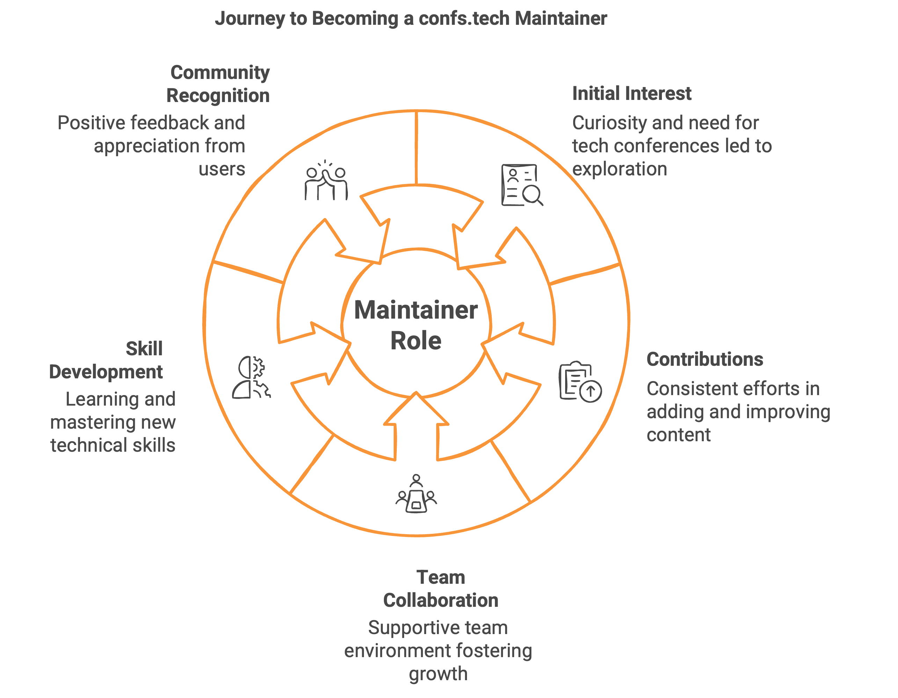
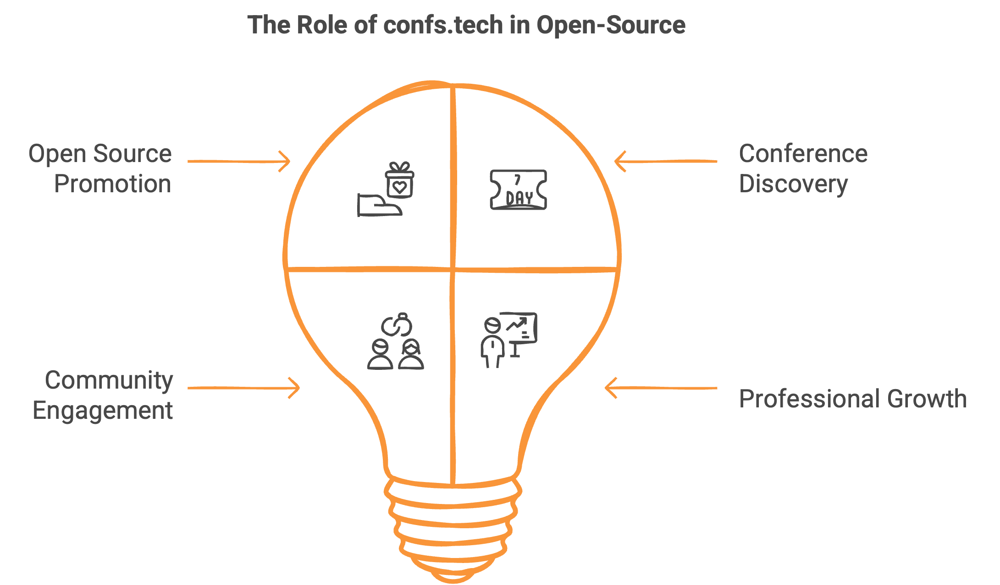
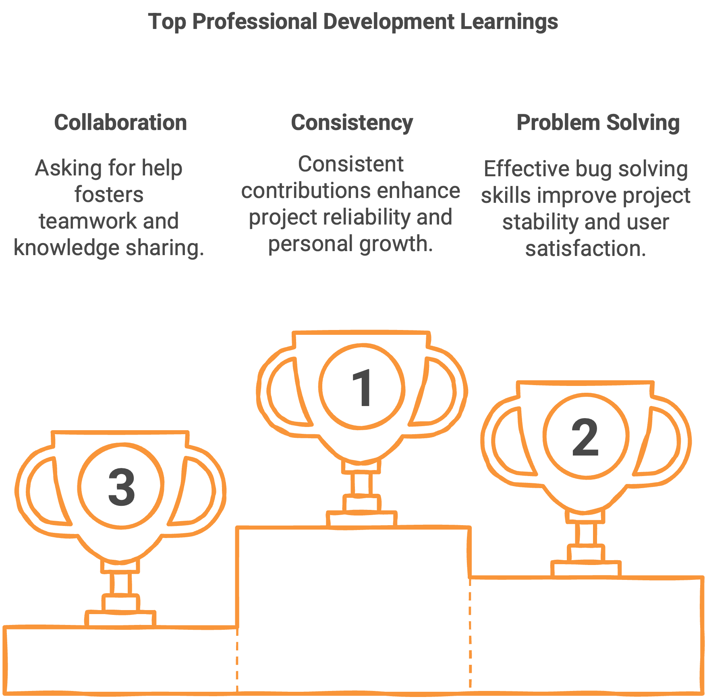

# My Experience as a confs.tech Maintainer: Promoting Open Source

The world of open source software is full of opportunities for those who want to contribute, learn, and grow professionally. Today I want to share my experience as a maintainer of [confs.tech](https://confs.tech/pages/team), a resource that has become an important part of my professional life and has allowed me to promote open source in a meaningful way.

## What is confs.tech?

For those who aren't familiar, [confs.tech](https://confs.tech/pages/team) is a comprehensive, open-source list of conferences related to software development. The project solves a common problem in the tech community: easily finding relevant conferences to attend, present at, or simply stay informed about events in the industry.

As its description states:

> confs.tech: List of all tech conferences of the year. Find your next tech conference. An open-source and crowd-sourced list of conferences around software development.

::github{repo="tech-conferences/confs.tech"}

::github{repo="tech-conferences/conference-data"}

## My Journey to confs.tech

My relationship with confs.tech began organically. I was looking for a tech conference to attend when I came across this resource. While exploring the site, I discovered that anyone could contribute by adding more conferences. I decided to do so, and the experience was incredibly rewarding.

What attracted me most to the project was the team behind it. There are several maintainers, and they all respond very quickly, which makes the contribution process smooth and motivating.

## From Contributor to Maintainer

My transition from contributor to project maintainer was the result of consistent dedication. I made over 400 PRs (Pull Requests) and contributions to the project. I became so passionate about confs.tech that when I saw the opportunity, I took it without hesitation. I asked if I could help in a more official capacity, and they gave me access as a maintainer, along with a list of responsibilities.

## My Most Significant Contributions

Among my various contributions, there's one I'm particularly proud of: creating a dedicated page to showcase the team behind the project. This page highlights the maintainers first and then the contributors, with the aim of promoting participation and giving visibility to those who make this resource possible.

I also implemented similar changes to the project's README, all with the goal of recognizing the work of those behind confs.tech and fostering a sense of community.

Additionally, I've contributed to various aspects of the UI, updating packages, fixing bugs, and making numerous contributions to increase the list of available conferences on the platform.

## Challenges and Learnings

As a maintainer, I've faced several challenges. Reviewing PRs was new to me, but I overcame this through practice, studying similar PRs, and observing how others solved similar problems to learn best practices.

Another major challenge was understanding the site's architecture and how it works. I approached this by reading the code and reviewing previous PRs. Even today, I continue to learn constantly about the project.

## The Impact on My Professional Development

Being a maintainer of confs.tech has significantly enriched my professional development. I've learned:

- To be consistent in my contributions
- To effectively solve bugs
- To ask for help when I don't know how to resolve something
- To organize my time to be able to dedicate attention to the project
- To propose useful new features
- To correct potential errors
- To review PRs with judgment, carefully evaluating proposed conferences
- To deepen my knowledge of Git and GitHub

## The Satisfaction of Recognition

One of the greatest satisfactions as a maintainer is receiving positive feedback from users. There have been many occasions when people recognize our work and express gratitude for this resource that has been very useful for finding conferences. This positive feedback is what motivates me to continue contributing to the project.

## Balancing Time and Responsibilities

Contributing to an open source project while managing other personal and professional responsibilities requires balance. As I like to say: life is about balance; one cannot expect to learn programming in a day. Just as we didn't learn to walk in a day, we also cannot expect to create an open source project and be recognized for it immediately.

It's all about consistency, dedication, and perseverance. It's about organizing yourself, finding time during the day, whether starting with 20 minutes daily or dedicating a few hours on weekends. Little by little, everything flows.

In the end, we make time for what matters to us. It's also about evaluating the benefit of it, which in my case has been enormous both personally and professionally.

## Advice for Future Contributors

If you're interested in contributing to open source, my advice is simple: find a project you like, something you use day to day. If it's open source, don't hesitate to contribute. Ask how you can help, review existing PRs and issues, and start from the simplest things.

You don't need to make big contributions from the beginning. Every small contribution counts, and over time, you can become an essential part of the community around the project.

## Conclusion

My experience as a maintainer of confs.tech has been incredibly enriching. It has allowed me not only to improve my technical skills but also to be part of a global community that values and promotes open source.

If you're considering contributing to an open source project, I encourage you to take the step. You'll not only be helping to improve a tool that others use, but you'll also be investing in your own professional and personal growth.

Remember: success in open source, as in many other areas of life, is built step by step, with dedication and perseverance.

