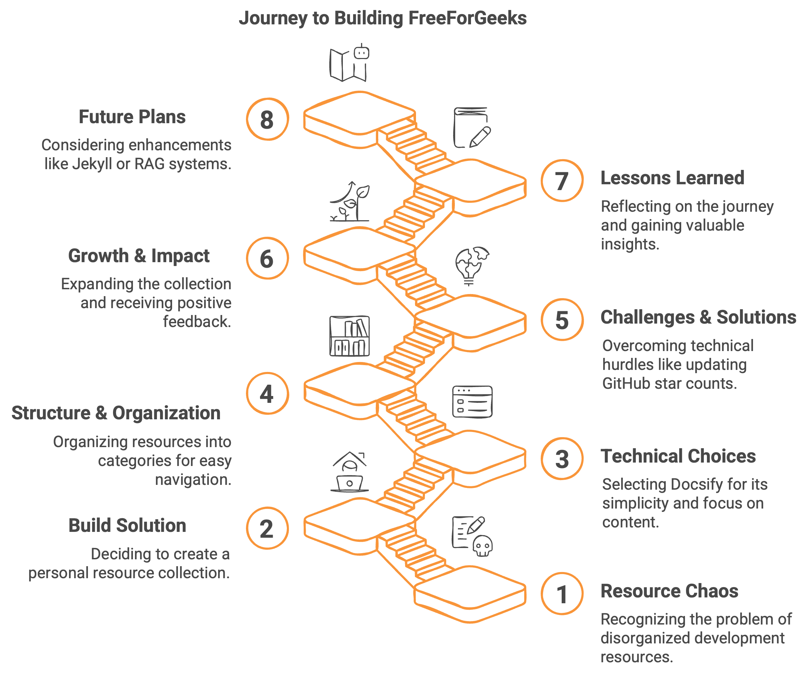
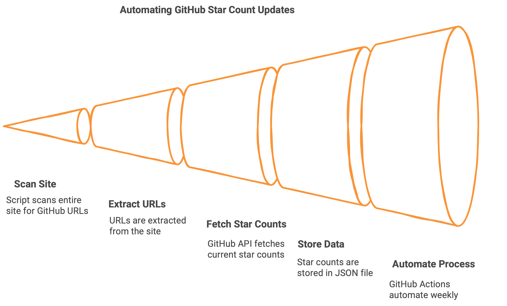
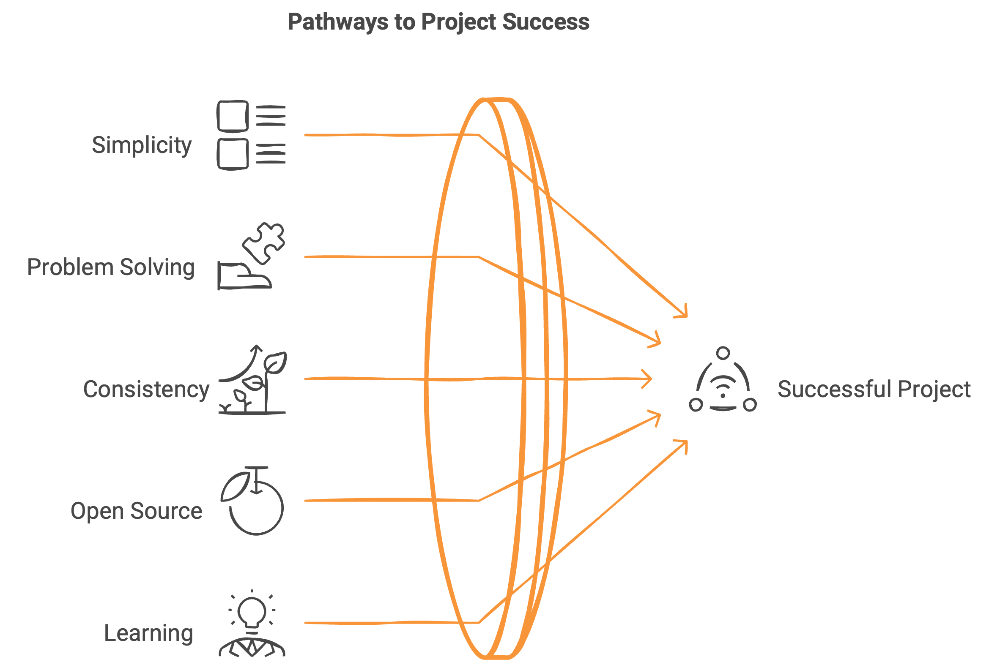

## El Problema: Caos de Recursos

Como desarrolladores, todos luchamos con el mismo desafío: hay innumerables herramientas y recursos increíbles disponibles, pero encontrarlos y organizarlos es una pesadilla. Yo no era diferente.

Durante años, llevé un registro de recursos útiles para el desarrollo en una mezcolanza de documentos de Word y archivos markdown dispersos. Algunos eran marcadores, otros eran notas, pero ninguno estaba organizado de una manera que los hiciera verdaderamente accesibles cuando los necesitaba.

Lo que me frustraba aún más era que muchas colecciones existentes estaban incompletas, abandonadas por sus creadores, o simplemente no incluían las herramientas específicas que buscaba como desarrollador frontend. Como alguien relativamente nuevo en GitHub y el ecosistema de código abierto en ese momento, me resultaba difícil encontrar un recurso único y completo que satisficiera mis necesidades.

## La Solución: Construirlo Yo Mismo

En febrero de 2024, decidí resolver mi propio problema. Si no podía encontrar la colección de recursos perfecta, la construiría yo mismo—y la haría de código abierto para que otros también pudieran beneficiarse.

Así nació [FreeForGeeks](https://freeforgeeks.jpdiaz.dev).

::github{repo="juanpablodiaz/freeforgeeks"}

La visión era simple: crear una colección bien organizada y completa de recursos gratuitos para desarrolladores en diferentes dominios. Aunque comencé enfocándome en frontend (mi área de especialización), quería construir algo que creciera para cubrir múltiples disciplinas.

## Elecciones Técnicas: Abrazo a la Simplicidad

Al comenzar cualquier proyecto, la elección de la pila tecnológica es crucial. Opté deliberadamente por la simplicidad sobre la complejidad, seleccionando [Docsify](https://docsify.js.org/) como mi base.

¿Por qué Docsify? Es sencillo, requiere una configuración mínima y se centra en el contenido en lugar de características llamativas. Como alguien que venía del ecosistema de React, esto fue una salida de mi zona de confort, pero la elección correcta para los objetivos del proyecto.

Quería dedicar mi tiempo a seleccionar recursos de alta calidad, no a luchar con frameworks complejos o configuraciones excesivas. Docsify me permitió centrarme en lo que importaba: el contenido mismo.

## Estructura y Organización

FreeForGeeks está organizado en varias categorías principales:

- **Frontend** (naturalmente mi sección más completa)
- **Backend**
- **DevSecOps**
- **Open Source**
- **Others**
- **Resources**
- **Career Development**
- **Other Resources**

Esta estructura evolucionó orgánicamente a medida que descubría y añadía nuevas herramientas, siempre haciendo la pregunta crítica: "¿Dónde buscaría esto si lo necesitara?"

## Desafíos Técnicos y Soluciones

Aunque la simplicidad de Docsify era su fortaleza, también presentaba desafíos. El mayor era mantener precisos los recuentos de estrellas de GitHub.

Inicialmente, agregaba manualmente los recuentos de estrellas para cada recurso, pero estos números quedaban desactualizados casi inmediatamente. Sin capacidades de obtención dinámica de contenido como estaba acostumbrado en React, necesitaba encontrar otra solución.

Después de varios intentos, recientemente construí un sistema que:

1. Utiliza un script para escanear todo el sitio
2. Extrae todas las URLs de GitHub
3. Obtiene el recuento actual de estrellas de cada una usando la API de GitHub
4. Almacena estos datos en un archivo `data/stars.json`
5. Automatiza todo el proceso con GitHub Actions que se ejecutan diariamente

Incluso implementé un token secreto para evitar alcanzar los límites de tasa de la API de GitHub. No es una solución compleja, pero es efectiva, resolviendo un problema real que afectaba la fiabilidad de la información.

Como escribí en una publicación reciente de LinkedIn: "No es llamativo. No es complejo. Pero funciona, y resuelve un problema real".

## Crecimiento e Impacto

FreeForGeeks comenzó como un proyecto personal con solo un puñado de recursos. Hoy, alberga más de 450 herramientas y recursos cuidadosamente seleccionados, el resultado de más de 400 commits y innumerables horas de trabajo desde febrero de 2024.

Aunque las contribuciones externas han sido limitadas, el proyecto ha acumulado 51 estrellas en GitHub—una indicación modesta pero significativa que otros encuentran valor en mis esfuerzos de curación.

Más importante aún, ha sido un tremendo viaje de aprendizaje. Desde mejorar mis habilidades de Git hasta aprender sobre generadores de sitios, desde entender GitHub Actions hasta implementar integraciones de API—cada desafío ha expandido mi repertorio técnico.

## Lecciones Aprendidas

Construir y mantener FreeForGeeks me ha enseñado varias lecciones importantes:

1. **Comienza simple y enfócate en el contenido**: No te distraigas con características llamativas o arquitectura compleja cuando tu valor principal es el contenido mismo.

2. **Resuelve problemas reales**: El trabajo más satisfactorio proviene de solucionar puntos de dolor reales, incluso si parecen pequeños.

3. **La consistencia importa más que la perfección**: El proyecto ha crecido a través de mejoras regulares e incrementales, no de revisiones dramáticas.

4. **La contribución al código abierto es gratificante**: Hay una satisfacción única en crear algo que otros pueden usar libremente y potencialmente construir sobre ello.

5. **Los desafíos técnicos son oportunidades de aprendizaje**: Cada problema que encontré y resolví expandió mis capacidades como desarrollador.

## Mirando hacia el Futuro

Aunque estoy contento con FreeForGeeks en su forma actual, continúo manteniéndolo activamente—añadiendo nuevos recursos, mejorando la organización y realizando mejoras incrementales.

He considerado explorar Jekyll como una alternativa a Docsify para mejorar las capacidades de la interfaz de usuario mientras mantengo el mismo contenido en markdown. Otra posibilidad interesante es implementar un sistema RAG (Generación Aumentada por Recuperación) para hacer que el contenido sea aún más accesible y buscable.

Sin embargo, mi enfoque principal sigue siendo la calidad y utilidad de los recursos mismos en lugar de adornos tecnológicos.

## Una Nota Personal

FreeForGeeks comenzó como el intento de un desarrollador inexperto de resolver un problema personal. Con dedicación y persistencia, ha crecido hasta convertirse en algo de lo que estoy genuinamente orgulloso.

Para cualquiera que esté considerando iniciar su propio proyecto de código abierto, mi consejo es simple: nunca dejes de aprender, nunca dejes de crear. No me arrepiento ni un solo momento dedicado a contribuir a proyectos de código abierto.

Contribuir—ya sea a través de documentación, revisión de PRs, reporte de errores, corrección de enlaces rotos, sugerencia de características, o simplemente haciendo preguntas—te hace parte de algo más grande que tú mismo. Te ayuda a crecer como desarrollador mientras retribuyes a la comunidad que nos apoya a todos.

Lo que comenzó como una pequeña colección es ahora un recurso completo que me ayuda diariamente en mi trabajo—y espero que ayude a otros también. Esa es la magia del código abierto: las soluciones personales pueden convertirse en activos comunitarios.

Visita [FreeForGeeks](https://freeforgeeks.jpdiaz.dev) para explorar la colección, y si la encuentras útil, considera darle una estrella en GitHub. Cada reconocimiento alimenta la motivación para seguir mejorando y expandiendo este proyecto hecho con amor.
