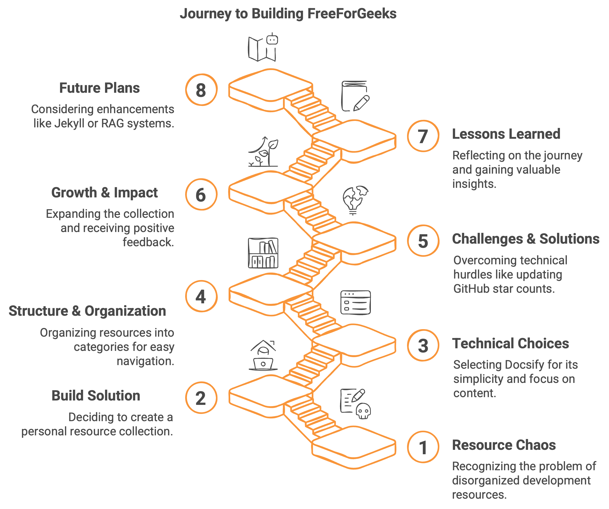
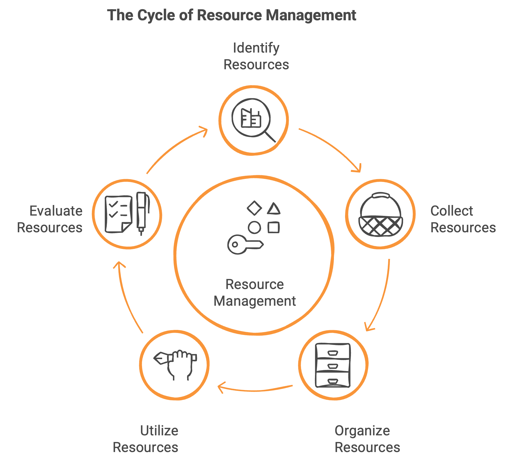
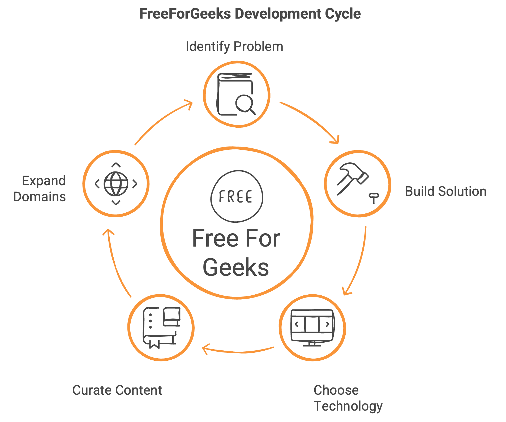
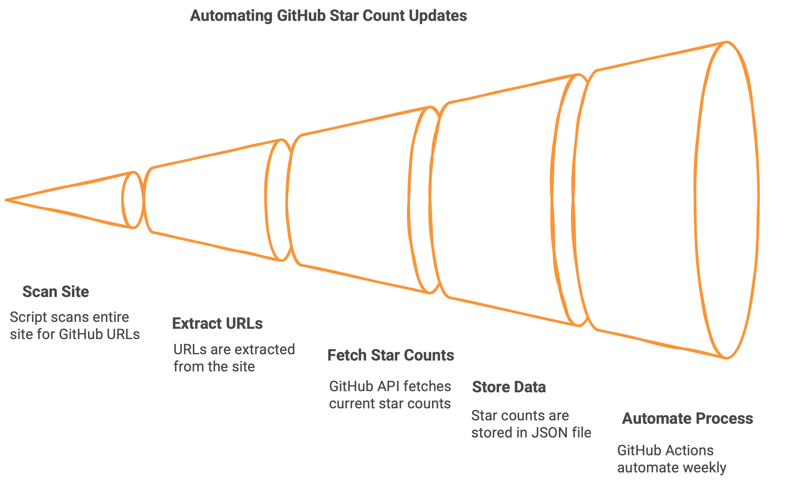
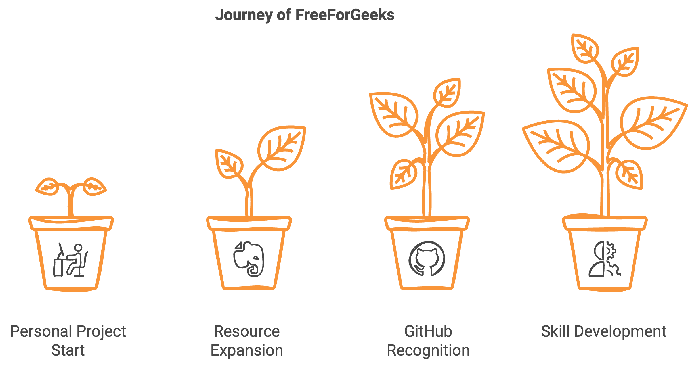
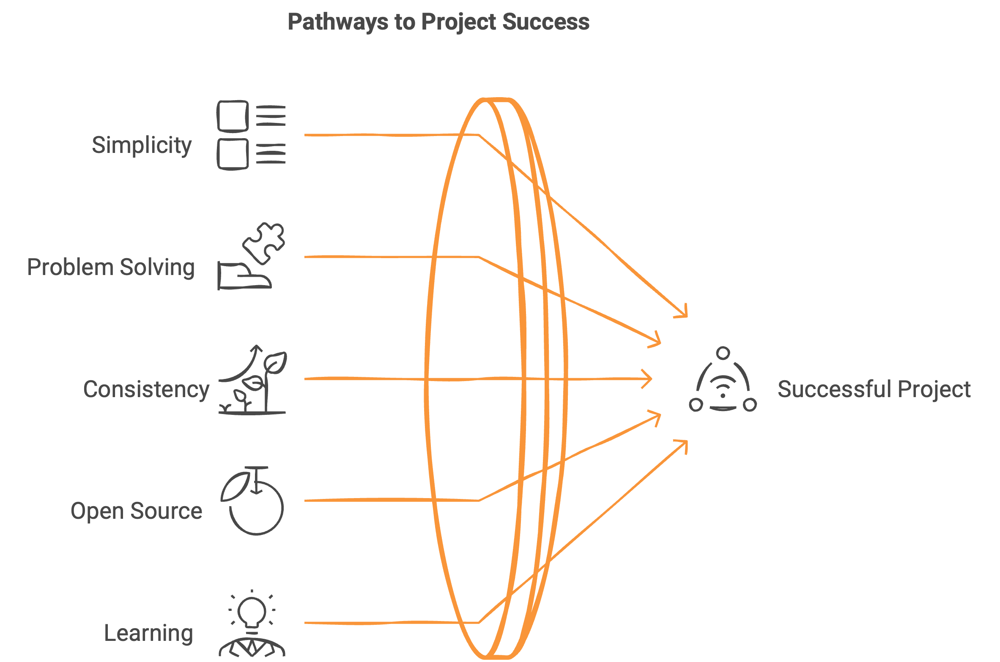

## The Problem: Resource Chaos

As developers, we all struggle with the same challenge: there are countless amazing tools and resources available, but finding and organizing them is a nightmare. I was no different.

For years, I kept track of useful development resources in a hodgepodge of Word documents and scattered markdown files. Some were bookmarks, others were notes—but none were organized in a way that made them truly accessible when I needed them.

What frustrated me even more was that many existing collections were either incomplete, abandoned by their creators, or simply didn't include the specific tools I was looking for as a frontend developer. As someone who was relatively new to GitHub and the open source ecosystem at the time, I found it difficult to locate a single, comprehensive resource that met my needs.

## The Solution: Build It Myself

In February 2024, I decided to solve my own problem. If I couldn't find the perfect resource collection, I would build it myself—and make it open source so others could benefit too.

Thus, [FreeForGeeks](https://freeforgeeks.jpdiaz.dev) was born.

::github{repo="juanpablodiaz/freeforgeeks"}

The vision was simple: create a well-organized, comprehensive collection of free resources for developers across different domains. While I started with a focus on frontend (my area of expertise), I wanted to build something that would grow to cover multiple disciplines.

## Technical Choices: Embracing Simplicity

When starting any project, the choice of technology stack is crucial. I deliberately opted for simplicity over complexity, selecting [Docsify](https://docsify.js.org/) as my foundation.

Why Docsify? It's straightforward, requires minimal configuration, and focuses on content rather than flashy features. As someone coming from the React ecosystem, this was a departure from my comfort zone—but the right choice for the project's goals.

I wanted to spend my time curating high-quality resources, not fighting with complex frameworks or wrestling with excessive configuration. Docsify let me focus on what mattered: the content itself.

## Structure and Organization

FreeForGeeks is organized into several main categories:

- **Frontend** (naturally my most comprehensive section)
- **Backend**
- **DevSecOps**
- **Open Source**
- **Others**
- **Resources**
- **Career Development**
- **Other Resources**

This structure evolved organically as I discovered and added new tools, always asking the critical question: "Where would I look for this if I needed it?"

## Technical Challenges and Solutions

While Docsify's simplicity was its strength, it also presented challenges. The biggest one was keeping GitHub star counts accurate.

Initially, I manually added star counts for each resource, but these numbers became outdated almost immediately. Without dynamic content fetching capabilities like I was used to in React, I needed to find another solution.

After several attempts, I recently built a system that:

1. Uses a script to scan the entire site
2. Extracts all GitHub URLs
3. Fetches the current star count for each using the GitHub API
4. Stores this data in a `data/stars.json` file
5. Automates the entire process with GitHub Actions that run daily

I even implemented a secret token to avoid hitting GitHub's API rate limits. It's not a complex solution, but it's effective—solving a real problem that affected the reliability of the information.

As I wrote in a recent LinkedIn post: "It's not flashy. It's not complex. But it works—and it solves a real issue."

## Growth and Impact

FreeForGeeks started as a personal project with just a handful of resources. Today, it hosts more than 450 carefully curated tools and resources, the result of over 400 commits and countless hours of work since February 2024.

While external contributions have been limited, the project has garnered 51 GitHub stars—a modest but meaningful indication that others find value in my curation efforts.

More importantly, it's been a tremendous learning journey. From improving my Git skills to learning about site generators, from understanding GitHub Actions to implementing API integrations—each challenge has expanded my technical repertoire.

## Lessons Learned

Building and maintaining FreeForGeeks has taught me several important lessons:

1. **Start simple and focus on content**: Don't get distracted by fancy features or complex architecture when your core value is the content itself.

2. **Solve real problems**: The most satisfying work comes from fixing actual pain points, even if they seem small.

3. **Consistency matters more than perfection**: The project has grown through regular, incremental improvements—not dramatic overhauls.

4. **Open source contribution is rewarding**: There's a unique satisfaction in creating something that others can use freely and potentially build upon.

5. **Technical challenges are learning opportunities**: Each problem I encountered and solved expanded my capabilities as a developer.

## Looking Forward

While I'm content with FreeForGeeks in its current form, I continue to maintain it actively—adding new resources, improving organization, and making incremental enhancements.

I've considered exploring Jekyll as an alternative to Docsify for improved UI capabilities while maintaining the same markdown content. Another intriguing possibility is implementing a RAG (Retrieval-Augmented Generation) system to make the content even more accessible and searchable.

However, my primary focus remains on the quality and usefulness of the resources themselves rather than technological bells and whistles.

## A Personal Note

FreeForGeeks began as an inexperienced developer's attempt to solve a personal problem. With dedication and persistence, it has grown into something I'm genuinely proud of.

To anyone considering starting their own open source project, my advice is simple: never stop learning, never stop creating. I don't regret a single moment spent contributing to open source projects.

Contributing—whether through documentation, reviewing PRs, reporting bugs, fixing broken links, suggesting features, or simply asking questions—makes you part of something larger than yourself. It helps you grow as a developer while giving back to the community that supports us all.

What started as a small collection is now a comprehensive resource that helps me daily in my work—and hopefully helps others too. That's the magic of open source: personal solutions can become community assets.

Visit [FreeForGeeks](https://freeforgeeks.jpdiaz.dev) to explore the collection, and if you find it useful, consider giving it a star on GitHub. Every bit of recognition fuels the motivation to keep improving and expanding this labor of love.
