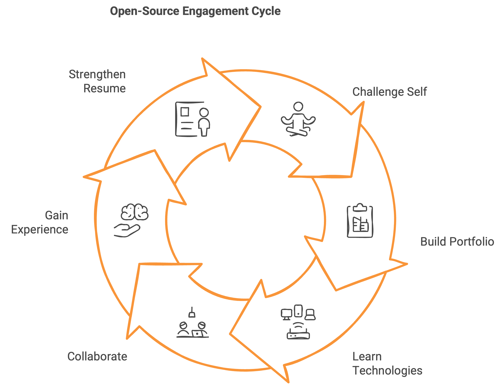
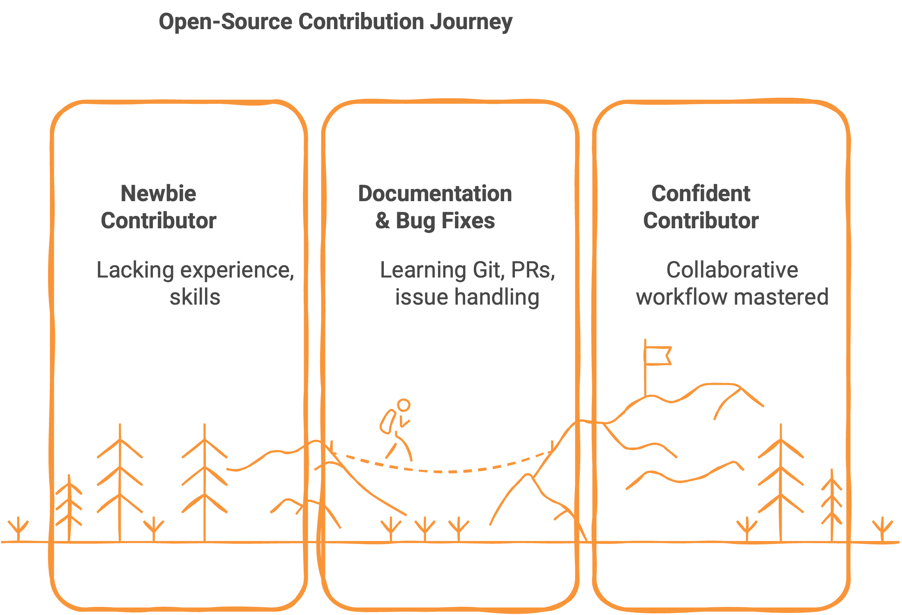
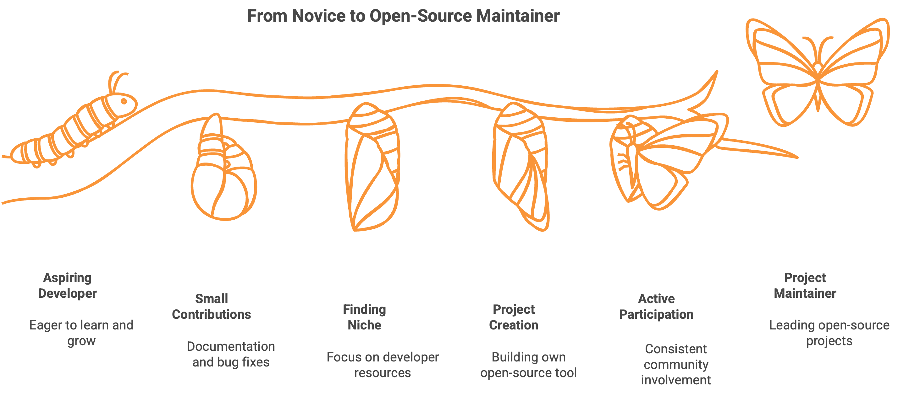

# Código Abierto: Una Aventura que Transformó mi Desarrollo

## El Comienzo: ¿Por Qué Código Abierto?

Como muchos desarrolladores, inicialmente me sentí atraído por el código abierto por varias razones convincentes. Quería salir de mi zona de confort y desafiarme en nuevos entornos. Estaba el atractivo de construir un portafolio público donde la gente pudiera descubrir mi trabajo y mis habilidades. Y, por supuesto, estaba ansioso por aprender nuevas tecnologías mientras colaboraba con otros que pudieran ayudarme a crecer profesionalmente.

Más allá del crecimiento personal, también reconocí los beneficios prácticos: obtener experiencia en el mundo real y fortalecer mi currículum con contribuciones tangibles a GitHub que los posibles empleadores pudieran examinar. El código abierto ofrecía todo esto en un solo paquete.

## Primeros Pasos: Empezando Poco a Poco

Mi viaje comenzó como el de la mayoría de los colaboradores: con pequeños y manejables primeros pasos. Empecé con mejoras en la documentación y correcciones de errores simples, centrándome principalmente en aprender la mecánica: cómo usar Git correctamente, crear pull requests, encontrar problemas apropiados para abordar y navegar por el proceso de contribución.

Estas contribuciones iniciales podrían haber parecido menores, pero sirvieron a un propósito crucial. Me ayudaron a comprender el flujo de trabajo colaborativo del desarrollo de código abierto y a construir confianza en mi capacidad para contribuir de manera significativa.

## Encontrando Mi Nicho

A medida que exploraba GitHub más extensamente, descubrí una afinidad por un tipo particular de proyecto: recursos y herramientas para desarrolladores para el aprendizaje. Me encontré gravitando naturalmente hacia colecciones y listas curadas que ayudan a los desarrolladores a encontrar las herramientas adecuadas para su trabajo.

Esta fase de exploración fue crítica: me ayudó a identificar dónde mis intereses y habilidades podrían proporcionar el mayor valor. En lugar de dispersarme demasiado en muchos tipos diferentes de proyectos, encontré un enfoque que me energizó.

## Dando el Salto: Creando Mi Propio Proyecto

Para febrero de 2024, mi pasión por los recursos para desarrolladores había crecido tanto que decidí crear mi propio proyecto de código abierto: [FreeForGeeks](https://freeforgeeks.jpdiaz.dev). El proyecto nació de una necesidad práctica: había estado recopilando recursos de desarrollo útiles en documentos de Word y archivos Markdown, pero necesitaba una mejor manera de organizarlos y acceder a ellos.

Lo que comenzó como una solución personal se ha convertido en un recurso comunitario con 51 estrellas en GitHub. Free For Geeks sirve como una caja de herramientas curada de recursos gratuitos para desarrolladores que construyen software, abordando una brecha que había notado en las colecciones existentes.

## El Camino a Mantenedor

Mi transición de colaborador a mantenedor ocurrió orgánicamente a través de una participación constante y un compromiso demostrado. Después de numerosas pull requests y una participación activa en varias comunidades, comencé a asumir más responsabilidades:

- **[Confs.tech](https://confs.tech/pages/team)** (Mantenedor desde abril de 2024): Una lista de código abierto y de colaboración colectiva de conferencias tecnológicas sobre desarrollo de software. He contribuido significativamente a la interfaz de usuario, ayudé a actualizar paquetes, corregí errores y agregué numerosas conferencias a la base de datos.

::github{repo="tech-conferences/confs.tech"}

::github{repo="tech-conferences/conference-data"}

- **[Public APIs](https://publicapis.dev)** (Mantenedor desde julio de 2024): Una colección completa de APIs públicas para desarrolladores, categorizadas en numerosos dominios, incluyendo animales, libros, criptomonedas, herramientas de desarrollo, música, clima y más. Mi trabajo incluye la expansión de los listados de APIs disponibles y la revisión de pull requests.

::github{repo="marcelscruz/public-apis"}

- **[Dev Resources](https://devresourc.es)** (Mantenedor desde julio de 2024): Una colección de recursos para desarrolladores que incluye tutoriales de programación, inspiración de UI, bolsas de trabajo, imágenes, iconos y mucho más. Me centro en la expansión de los listados de recursos y la revisión de las contribuciones de la comunidad.

::github{repo="marcelscruz/dev-resources"}

## Superando Desafíos

El viaje no ha estado exento de obstáculos. Con frecuencia me he encontrado con tecnologías y frameworks desconocidos que inicialmente parecían intimidantes. En un incidente particularmente estresante, implementé un cambio que rompió un sitio web de producción, una aleccionadora lección sobre la responsabilidad que conlleva la contribución al código abierto.

Al enfrentar estos desafíos, he recurrido a varias estrategias:

- Consultar la documentación a fondo
- Aprovechar herramientas de IA como ChatGPT para comprender conceptos complejos
- Contactar a miembros de la comunidad en Discord y otras plataformas
- Ser lo suficientemente humilde para pedir ayuda cuando es necesario

Cada desafío superado ha añadido a mi caja de herramientas técnicas y a mi confianza.

## Impacto en el Crecimiento Profesional

Mis contribuciones al código abierto han mejorado drásticamente mis capacidades técnicas y mi confianza. Mi perfil de GitHub se fortalece cada día, mostrando no solo código, sino también mi capacidad para colaborar, comunicarme y comprometerme con proyectos a largo plazo.
Las habilidades que he adquirido van más allá del conocimiento técnico de programación: he aprendido gestión de comunidades, prácticas de revisión de código, estándares de documentación y cómo mentorizar eficazmente a los recién llegados. Estas son habilidades profesionales invaluables que mejoran mi experiencia general en desarrollo y continúan acelerando mi crecimiento.

## Consejos para Nuevos Colaboradores

Para cualquiera que esté considerando comenzar con el código abierto, mi consejo es simple: no dudes. Encuentra un proyecto que realmente disfrutes usar, familiarízate con su tecnología y comienza poco a poco. Recuerda que el crecimiento es un proceso: tus contribuciones mejorarán naturalmente con el tiempo a medida que profundices tu comprensión.

El espíritu del código abierto es increíblemente acogedor. La mayoría de las comunidades están ansiosas por ayudar a los recién llegados y aprecian cualquier nivel de contribución. Incluso las pequeñas correcciones o las mejoras en la documentación son valiosos peldaños tanto para el proyecto como para tu crecimiento personal.

## Mirando Hacia Adelante

Mi viaje al código abierto continúa evolucionando. Si bien mantendré mis proyectos actuales, estoy fijando mi mirada en contribuir a proyectos más grandes y visibles, particularmente en ingeniería de datos. Unity Catalog, Delta Lake, MLFlow y varios proyectos de Apache están en mi radar.

También estoy expandiendo mis tipos de contribución. Con Astro, por ejemplo, comencé traduciendo documentación, pero planeo contribuir también a la base de código de la interfaz de usuario. Esta diversidad de contribuciones mantiene el trabajo fresco y desafiante.

## Conclusión

La contribución al código abierto ha transformado mi viaje como desarrollador de una práctica solitaria a un esfuerzo comunitario. Me ha brindado oportunidades de aprendizaje que ningún tutorial podría igualar y conexiones con desarrolladores de todo el mundo que comparten mi pasión.

Ya sea que estés considerando tu primer pull request o pensando en mantener un proyecto, te animo a dar ese paso hacia el mundo del código abierto. La comunidad está esperando para darte la bienvenida, y tu perspectiva única podría ser exactamente lo que un proyecto necesita.

Recuerda: cada gran proyecto comenzó con una sola contribución, y cada mantenedor fue una vez un colaborador principiante. Tu viaje al código abierto solo está limitado por tu voluntad de participar.

