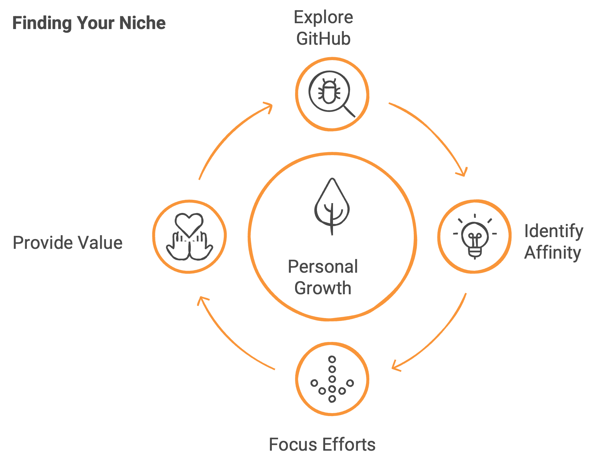
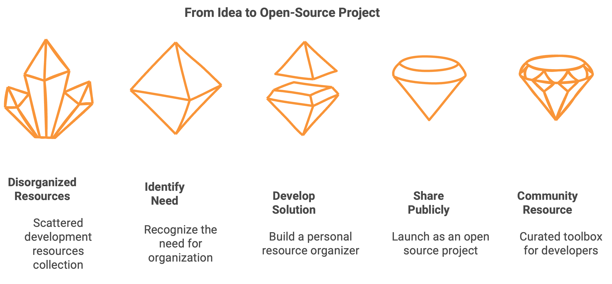
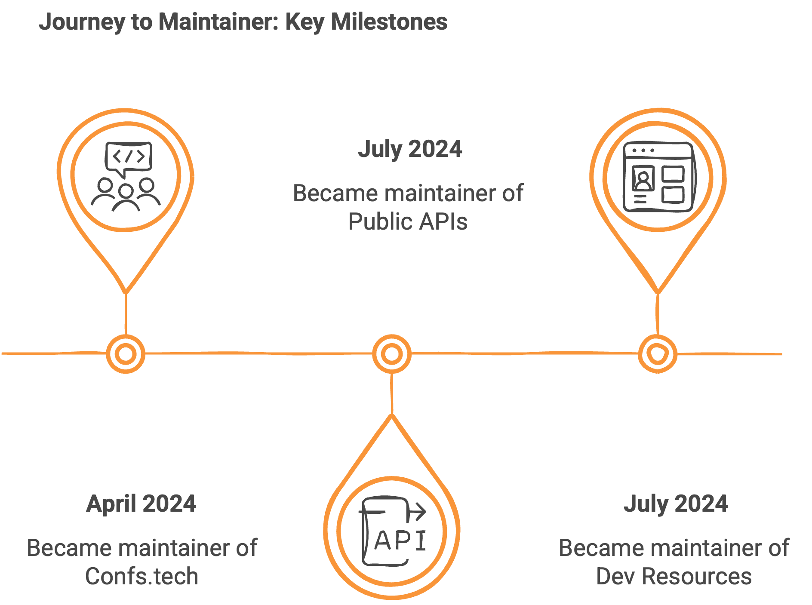
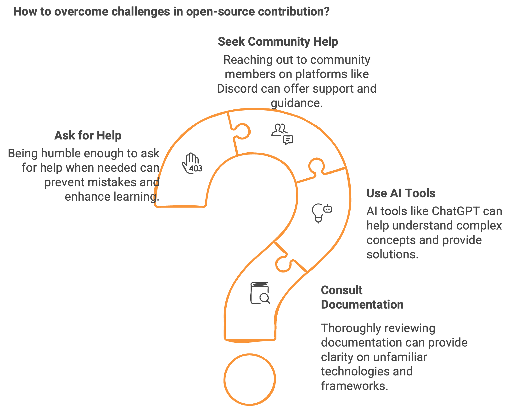

## The Beginning: Why Open Source?

Like many developers, I was initially drawn to open source for several compelling reasons. I wanted to step outside my comfort zone and challenge myself in new environments. There was the appeal of building a public portfolio where people could discover my work and skills. And of course, I was eager to learn new technologies while collaborating with others who could help me grow professionally.

Beyond personal growth, I also recognized the practical benefits: gaining real-world experience and strengthening my resume with tangible GitHub contributions that potential employers could examine. Open source offered all of this in one package.

## First Steps: Starting Small

My journey began like most contributors – with small, manageable first steps. I started with documentation improvements and simple bug fixes, primarily focusing on learning the mechanics: how to use Git properly, create pull requests, find appropriate issues to tackle, and navigate the contribution process.

These initial contributions might have seemed minor, but they served a crucial purpose. They helped me understand the collaborative workflow of open source development and build confidence in my ability to contribute meaningfully.

## Finding My Niche

As I explored GitHub more extensively, I discovered an affinity for a particular type of project: developer resources and tools for learning. I found myself naturally gravitating toward collections and curated lists that help developers find the right tools for their work.

This exploration phase was critical – it helped me identify where my interests and skills could provide the most value. Rather than spreading myself too thin across many different types of projects, I found a focus that energized me.

## Taking the Leap: Creating My Own Project

By February 2024, my passion for developer resources had grown so strong that I decided to create my own open source project: [Free For Geeks](https://freeforgeeks.jpdiaz.dev). The project was born from a practical need – I had been collecting useful development resources in word documents and markdown files but needed a better way to organize and access them.

What started as a personal solution has grown into a community resource with 51 GitHub stars. Free For Geeks serves as a curated toolbox of free resources for developers building software, addressing a gap I had noticed in existing collections.

## The Path to Maintainer

My transition from contributor to maintainer happened organically through consistent involvement and demonstrated commitment. After numerous pull requests and active participation in several communities, I began taking on more responsibility:

- **[Confs.tech](https://confs.tech)** (Maintainer since April 2024): An open-source, crowd-sourced list of tech conferences around software development. I've contributed significantly to the UI, helped update packages, fixed bugs, and added numerous conferences to the database.

::github{repo="tech-conferences/confs.tech"}

::github{repo="tech-conferences/conference-data"}

- **[Public APIs](https://publicapis.dev)** (Maintainer since July 2024): A comprehensive collection of public APIs for developers, categorized across numerous domains including animals, books, cryptocurrencies, development tools, music, weather and more. My work includes expanding the available API listings and reviewing pull requests.

::github{repo="marcelscruz/public-apis"}

- **[Dev Resources](https://devresourc.es)** (Maintainer since July 2024): A collection of resources for developers that includes programming tutorials, UI inspiration, job boards, images, icons and much more. I focus on expanding the resource listings and reviewing community contributions.

::github{repo="marcelscruz/dev-resources"}

## Overcoming Challenges

The journey hasn't been without obstacles. I've frequently encountered unfamiliar technologies and frameworks that initially seemed intimidating. In one particularly stressful incident, I deployed a change that broke a production website – a sobering lesson in the responsibility that comes with open source contribution.

When facing these challenges, I've relied on several strategies:

- Consulting documentation thoroughly
- Leveraging AI tools like ChatGPT to understand complex concepts
- Reaching out to community members on Discord and other platforms
- Being humble enough to ask for help when needed

Each challenge overcome has added to my technical toolkit and confidence.

## Impact on Professional Growth

My open source contributions have dramatically improved my technical capabilities and confidence. My GitHub profile grows stronger each day, showcasing not just code but my ability to collaborate, communicate, and commit to long-term projects.
The skills I've gained go beyond technical programming knowledge – I've learned community management, code review practices, documentation standards, and how to effectively mentor newcomers. These are invaluable professional skills that enhance my overall development expertise and continue to accelerate my growth.

## Advice for New Contributors

For anyone considering getting started with open source, my advice is simple: don't hesitate. Find a project you genuinely enjoy using, familiarize yourself with its technology, and start small. Remember that growth is a process – your contributions will naturally improve over time as your understanding deepens.

The spirit of open source is incredibly welcoming. Most communities are eager to help newcomers and appreciate any level of contribution. Even small fixes or documentation improvements are valuable stepping stones both for the project and for your personal growth.

## Looking Forward

My open source journey continues to evolve. While I'll maintain my current projects, I'm setting my sights on contributing to larger, more visible projects, particularly in data engineering. Unity Catalog, Delta Lake, MLFlow, and various Apache projects are all on my radar.

I'm also expanding my contribution types. With Astro, for example, I began by translating documentation, but I'm planning to contribute to the UI codebase as well. This diversity of contribution keeps the work fresh and challenging.

## Conclusion

Open source contribution has transformed my development journey from a solitary practice to a community endeavor. It's provided learning opportunities that no tutorial could match and connections with developers around the world who share my passion.

Whether you're considering your first pull request or thinking about maintaining a project, I encourage you to take that step into the open source world. The community is waiting to welcome you, and your unique perspective might be exactly what a project needs.

Remember: every major project began with a single contribution, and every maintainer was once a first-time contributor. Your open source journey is limited only by your willingness to participate.

