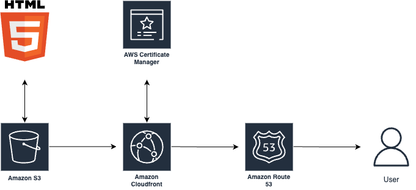

I’m pumped to share a cool AWS project I’ve been working on. Today, we’re diving into how to deploy a static website (HTML, CSS, and JavaScript) using **Amazon S3**, **CloudFront**, and **Route 53**. This guide is for junior devs and curious folks who want to learn AWS in a fun, hands-on way. I believe teaching is the best way to learn, so let’s break this down step by step—no overwhelming details, just the big picture to get you started!

**Project architecture:**

## Why This Project?

This setup is perfect for hosting a portfolio, blog, or small project, offering a custom domain, secure HTTPS, and lightning-fast global delivery. It’s an ideal way to explore AWS without getting lost in the weeds. I'm using a simple index.html homepage (linking to my profiles) as a Linktree alternative—a clean and effective way to manage your links. Ready? Let’s go!

## What You’ll Need

- A domain name (e.g., [follow.jpdiaz.dev](https://follow.jpdiaz.dev)) from a registrar like GoDaddy or Namecheap.
- An AWS account (the free tier works for most of this).
- A static website (HTML, CSS, JS).

## Step 1: Store Your Website in S3

**Amazon S3** is like a trusty cloud storage box for your website files—think of it as a **super cheap and scalable folder in the cloud** for literally anything you want.

- **Create an S3 bucket**: In the S3 console, make a bucket named exactly like your domain (e.g., `follow.jpdiaz.dev`).
- **Upload files**: Add your `index.html`, CSS, and JS files. Ensure your main page is `index.html`—it’s the default webpage name.
- **Stay secure**: We’re keeping the bucket private and using CloudFront to deliver content safely (more on that soon).

That’s it for S3—your files are now in the cloud!

## Step 2: Secure Your Domain with an SSL Certificate

To make your site secure with HTTPS, we’ll use **AWS Certificate Manager (ACM)** for a free SSL certificate.

- **Request a certificate**: In the ACM console, select the **us-east-1 (Northern Virginia)** region (CloudFront requires this).
- **Add your domain**: Enter `follow.jpdiaz.dev`. You can add a wildcard (e.g., `*.follow.jpdiaz.dev`) for subdomains.
- **Validate ownership**: Choose DNS validation. AWS will provide a record to add to your domain’s DNS settings (we’ll do this in Route 53).

Once validated, your SSL certificate is ready to secure your site.

## Step 3: Set Up CloudFront for Speed

**CloudFront** is AWS’s Content Delivery Network (CDN), making your site load fast worldwide.

- **Create a distribution**: In CloudFront, select your S3 bucket as the “origin” (source of files).
- **Secure access**: Use **Origin Access Control (OAC)** so only CloudFront can access your S3 bucket.
- **Add SSL**: Choose the ACM certificate you created.
- **Set defaults**: Make `index.html` the default root object and enable HTTP-to-HTTPS redirection.
- **Optimize caching**: Use the “CachingOptimized” policy for faster load times.

Copy the bucket policy from CloudFront and add it to your S3 bucket’s permissions. Deployment takes a few minutes.

## Step 4: Connect Your Domain with Route 53

**Route 53** handles DNS to link your domain to CloudFront.

- **Create a hosted zone**: In Route 53, make a public hosted zone for `follow.jpdiaz.dev`. You’ll get NS (Name Server) and SOA (Start of Authority) records.
- **Validate the certificate**: Add the DNS validation record from Step 2 to your hosted zone. Validation is quick.
- **Map to CloudFront**: Create an **A record** with the “Alias” option pointing to your CloudFront distribution.

Update your domain registrar’s name servers to use Route 53’s NSClickable button records.

## Step 5: Test It Out!

Once CloudFront is deployed (check the console), visit `follow.jpdiaz.dev`. Your site should load with HTTPS! Click around to test links. You can also try the CloudFront URL, but your custom domain is the star.

## Why This Rocks

This setup is simple, secure, and fast:

- **Secure**: Private S3 + HTTPS via CloudFront and ACM.
- **Fast**: CloudFront’s global edge locations.
- **Scalable**: Handles traffic spikes easily.
- **Affordable**: Great for small projects.

## What I Learned

AWS services fit together like a puzzle—S3 stores, CloudFront distributes, and Route 53 connects. The key? CloudFront certificates must be in us-east-1. Once you nail that, it’s smooth sailing.

## What’s Next?

Try adding:

- AWS WAF for extra security.
- CloudWatch for performance insights.
- CI/CD pipelines for auto-updates.

I had a blast building this, and I hope it sparks your curiosity to try AWS! Let’s connect on [Linkedin](https://www.linkedin.com/in/1diazdev)—I’d love to hear whether you prefer this S3/CloudFront/Route 53 stack or AWS Amplify for your projects!
