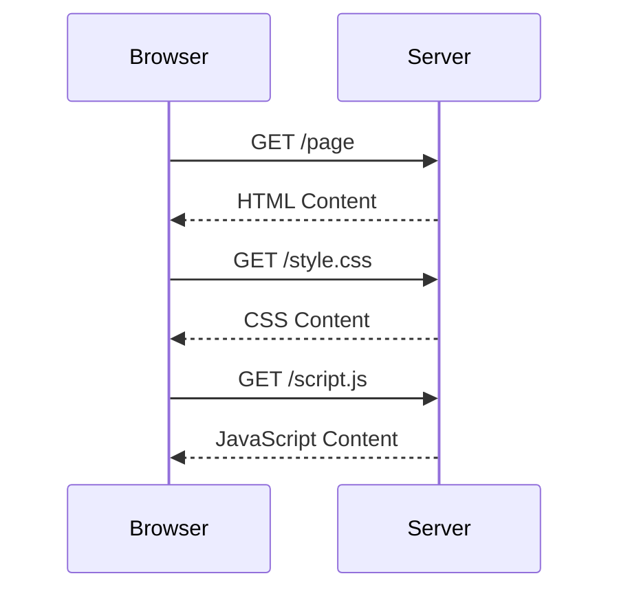

This post demonstrates all the features available in our blog posts.

## Basic Markdown

### Text Formatting

**Bold text** and _italic text_

### Lists

- Unordered list item 1
- Unordered list item 2
  - Nested item

1. Ordered list item 1
2. Ordered list item 2

### Links and Images

[Link to Google](https://google.com)


## Code Examples

### Inline Code

Use `console.log()` for debugging.

### Code Blocks with Syntax Highlighting

```javascript
// This is a JavaScript example
function greet(name) {
  return `Hello, ${name}!`;
}

console.log(greet('World'));
```

```python
# This is a Python example
def fibonacci(n):
    if n <= 1:
        return n
    return fibonacci(n-1) + fibonacci(n-2)

print(fibonacci(10))
```

### Collapsible Code Sections

```js collapsible="Click to see the code"
const complexCalculation = () => {
  let result = 0;
  for (let i = 0; i < 1000; i++) {
    result += Math.pow(i, 2);
  }
  return result;
};

console.log(complexCalculation());
```

## Advanced Features

### Admonitions

:::tip[Pro Tip]
You can use admonitions to highlight important information!
:::

:::note
This is a regular note.
:::

:::caution
Be careful with this section.
:::

:::danger
This is a dangerous operation!
:::

### Icons

You can use icons from Remix Icon:

<i class="ri-heart-fill text-xl text-red-500"></i>
<i class="ri-star-fill text-xl text-yellow-500"></i>
<i class="ri-github-fill text-xl"></i>

### Math Equations

Inline math: $ E = mc^2 $

Block math:
$$ \int\_{a}^{b} x^2 dx $$

### Mermaid Diagrams



### GitHub Card

::github{repo="withastro/astro"}

## Tables

| Feature           | Description                  | Status |
| ----------------- | ---------------------------- | ------ |
| Markdown          | Basic markdown support       | ✅     |
| Code Highlighting | Syntax highlighting for code | ✅     |
| Math              | LaTeX math equations         | ✅     |
| Diagrams          | Mermaid diagram support      | ✅     |

## Quotes

> This is a blockquote.
> It can span multiple lines.
>
> It can also have multiple paragraphs.

## Task Lists

- [x] Write the blog post
- [x] Add code examples
- [x] Include math equations
- [ ] Publish the post
